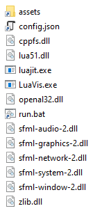

# LuaVis

Implementation of parts of Adrian Zeyfang's Master's thesis for the visualization of graphs derived from porous media datasets.

## Compilation

LuaVis depends on the following libraries (please use the linked repositories for compatibility):

- [LuaJIT](https://github.com/LuaJIT/LuaJIT)
- [cppfs](https://github.com/straubar/cppfs)
- [SFML](https://github.com/Marukyu/SFML)

### Windows

After building the dependencies and LuaVis, copy

- the *assets* folder,
- the *config.json* file,
- the *run.bat* script, and
- the DLL files from the dependencies

to the folder of the *LuaVis.exe* executable, such that the directory structure looks as follows:

## Usage

Start by executing the *run* script.

The graph shown is the one configured in line 14 of `assets/scripts/luavis/vis/Graph.lua`.

Stored graphs can be found in `assets/scripts/luavis/vis/data` and `assets/scripts/luavis/vis/graphdata`.
